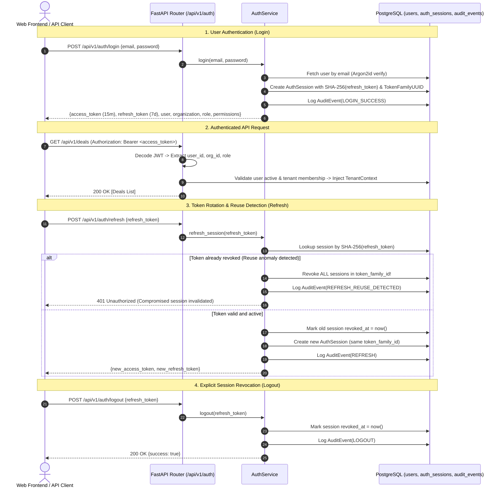

# DealGuard AI — Authentication, Session Lifecycle & RBAC Specification

> **Status**: Production Architecture Baseline  
> **Security Baseline**: Argon2id Hashing + Short-Lived JWT + Persistent Refresh Sessions (Token Family Rotation & Reuse Detection)  
> **Multi-Tenancy Model**: Server-side Authoritative Context Binding (`TenantContext`)  

---

## 1. Authentication Architecture & Token Lifecycle

---

## 2. RBAC Permission Matrix

| Permission | Description | `ADMIN` | `LEAD` | `ANALYST` | `REVIEWER` | `AUDITOR` |
| :--- | :--- | :---: | :---: | :---: | :---: | :---: |
| `organization:read` | View institutional organization profile | ✅ | ✅ | ✅ | ✅ | ✅ |
| `organization:manage` | Manage institutional tenant settings | ✅ | ❌ | ❌ | ❌ | ❌ |
| `users:read` | View institutional team members | ✅ | ✅ | ❌ | ❌ | ❌ |
| `users:manage` | Invite, assign, or deactivate users | ✅ | ❌ | ❌ | ❌ | ❌ |
| `deals:read` | View permitted deal rooms | ✅ | ✅ | ✅ | ✅ | ✅ |
| `deals:create` | Create new deal rooms & target company profiles | ✅ | ✅ | ✅ | ❌ | ❌ |
| `deals:update` | Edit deal parameters and metadata | ✅ | ✅ | ✅ | ❌ | ❌ |
| `deals:delete` | Archive / delete deal room | ✅ | ✅ | ❌ | ❌ | ❌ |
| `deals:manage_members` | Add/remove team members to deal room | ✅ | ✅ | ❌ | ❌ | ❌ |
| `documents:read` | Read data room documents and citations | ✅ | ✅ | ✅ | ✅ | ✅ |
| `documents:upload` | Ingest new documents into data room | ✅ | ✅ | ✅ | ❌ | ❌ |
| `documents:delete` | Delete uploaded documents | ✅ | ✅ | ❌ | ❌ | ❌ |
| `financials:read` | View 3-statement tables & metrics | ✅ | ✅ | ✅ | ✅ | ✅ |
| `financials:write` | Modify financial line items & manual inputs | ✅ | ✅ | ✅ | ❌ | ❌ |
| `risks:read` | View 17-pillar risk register & citations | ✅ | ✅ | ✅ | ✅ | ✅ |
| `risks:write` | Create / adjust risk scores | ✅ | ✅ | ✅ | ❌ | ❌ |
| `risks:review` | Approve, override, or accept risk findings | ✅ | ✅ | ❌ | ✅ | ❌ |
| `audit:read` | View immutable audit trail and review history | ✅ | ✅ | ❌ | ✅ | ✅ |
| `analysis:run` | Trigger valuation & sensitivity engines | ✅ | ✅ | ✅ | ❌ | ❌ |
| `analysis:review` | Review and sign off on investment committee pack | ✅ | ✅ | ❌ | ✅ | ❌ |

---

## 3. Deal-Level Team Scoping (`validate_deal_membership`)

1. **Organization Boundary**: A user must belong to the tenant organization owning the deal.
2. **Deal Team Assignment**: Non-admin users must have an active assignment record in `deal_members` (`LEAD`, `ANALYST`, `REVIEWER`, `LEGAL`, `AUDITOR`).
3. **Admin Override**: Users with role `ADMIN` or `is_superuser = True` have institutional administrative access across all deal rooms in their organization.
4. **IDOR Defense**: Accessing a deal without membership returns `403 Forbidden` (or `404 Not Found` if the deal belongs to an alien tenant, preventing resource existence enumeration).

---

## 4. Evaluation Credentials (Synthetic Seed Data)

| Role | Email | Password | Granted Scope |
| :--- | :--- | :--- | :--- |
| **Tenant Admin** | `admin@dealguard.ai` | `DemoPassword123!` | Full tenant administration across all deal rooms & users |
| **M&A Analyst** | `analyst@dealguard.ai` | `DemoPassword123!` | Financial modeling, document upload, risk analysis on assigned deals |
| **IC Reviewer** | `reviewer@dealguard.ai` | `DemoPassword123!` | Read-only diligence + risk review, override, and IC sign-off |
