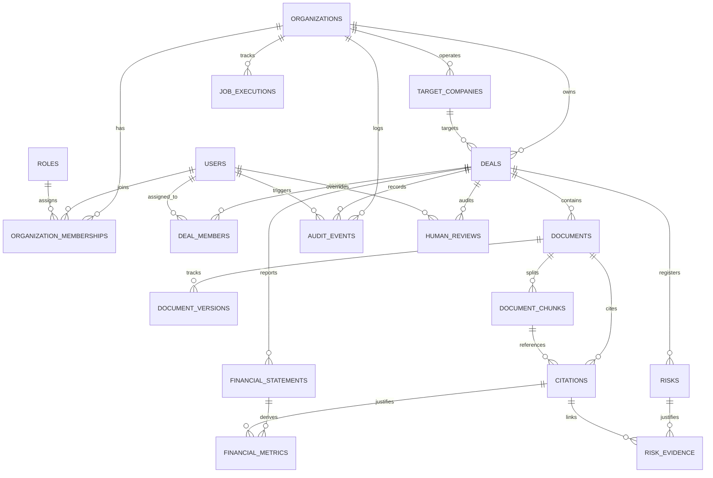

# DealGuard AI — Database Architecture & Domain Specification

> **Status**: Production Relational Baseline  
> **Target Database**: PostgreSQL 16 + pgvector (`vector(1536)`)  
> **ORM Layer**: SQLAlchemy 2.0 Typed Models + Alembic Migrations  

---

## 1. Domain Entity Relationship Diagram



---

## 2. Implemented Entity Tables

| Table | Scope | Primary Key | Description | Key Indexes & Constraints |
| :--- | :--- | :--- | :--- | :--- |
| `organizations` | Root Tenant | UUID | Institutional boundary / subscriber tenant | Unique `slug`, Index `id` |
| `users` | Global Identity | UUID | User authentication record | Unique `email`, Index `id` |
| `roles` | Global / Org | UUID | RBAC permissions definitions | Unique `name` |
| `organization_memberships` | Tenant Scoped | UUID | User-Organization-Role assignment | Unique `(organization_id, user_id)` |
| `target_companies` | Tenant Scoped | UUID | M&A acquisition target company profile | Index `(organization_id, name)` |
| `deals` | Tenant Scoped | UUID | M&A deal room and lifecycle workspace | Index `(organization_id, stage, status)` |
| `deal_members` | Tenant Scoped | UUID | User access assignments per deal room | Unique `(deal_id, user_id)` |
| `documents` | Tenant Scoped | UUID | Diligence data room file catalog & metadata | Index `(organization_id, deal_id, sha256_hash)` |
| `document_versions` | Tenant Scoped | UUID | Immutable document version tracker | Unique `(document_id, version_number)` |
| `document_chunks` | Tenant Scoped | UUID | Semantic chunks with `vector(1536)` | Index `(organization_id, deal_id, page_number)` |
| `citations` | Tenant Scoped | UUID | First-class evidence citations binding facts to files | Index `(deal_id, document_id)` |
| `financial_statements` | Tenant Scoped | UUID | Standardized 3-statement tables (P&L, BS, CF) | Unique `(deal_id, statement_type, fiscal_period)` |
| `financial_metrics` | Tenant Scoped | UUID | Time-series quantitative metrics | Index `(deal_id, metric_name, period)` |
| `risks` | Tenant Scoped | UUID | 17-pillar explainable risk scoring items | Index `(organization_id, deal_id, category)` |
| `risk_evidence` | Tenant Scoped | UUID | Grounded evidence links joining risks to citations | Index `(risk_id, citation_id)` |
| `audit_events` | Tenant Scoped | UUID | Monotonic append-only compliance audit ledger | Index `(organization_id, action, created_at)` |
| `human_reviews` | Tenant Scoped | UUID | Human-in-the-loop review and AI override ledger | Index `(deal_id, target_entity_type, target_entity_id)` |
| `job_executions` | Tenant Scoped | UUID | Celery background task state tracker | Index `(organization_id, status)` |

---

## 3. Multi-Tenancy Security Model

1. **Server-Side Context Enforcement**: All database queries require a valid `TenantContext` containing `organization_id`.
2. **Explicit Foreign Keys**: Every resource inherits from `TenantScopedModel` with an explicit `organization_id` foreign key referencing `organizations.id ON DELETE CASCADE`.
3. **Cross-Tenant Attack Resistance**: Direct lookups by ID outside of the calling organization return `NotFoundException` (404), completely preventing enumeration and cross-tenant leakage.

---

## 4. Running Migrations & Seeder

```bash
# 1. Run Alembic database migrations
cd backend
alembic upgrade head

# 2. Seed realistic synthetic M&A datasets (ApexCloud, TitanPrecision, MedVance)
cd ..
./scripts/seed.sh

# 3. Run all database and isolation tests
./scripts/test.sh
```
