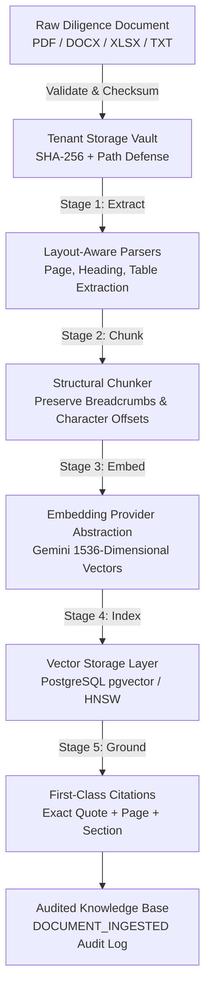

# DealGuard AI — Document Ingestion & Knowledge Pipeline (Phase 4)

## Overview

The Document Ingestion and Knowledge Pipeline is the evidence foundation of DealGuard AI. It processes diligence packets, quality-of-earnings (QoE) reports, customer contracts, 3-statement financial models, and SEC filings into structured, citation-grounded vector indices for downstream valuation, risk intelligence, and post-deal value creation engines.



---

## 1. Supported Document Formats & Parsers

| Format | Parser Engine | Features & Preserved Metadata |
| :--- | :--- | :--- |
| **PDF** | `pypdf` | Page-aware segmentation (`page_number`), regex heading detection (`Item 1`, `Note 8`, `Section 3`), prompt injection sanitization. |
| **DOCX** | `python-docx` | Native XML heading hierarchy (`Heading 1`, `Heading 2`, `Title`), table row/column extraction formatted as markdown grids. |
| **XLSX** | `openpyxl` | Multi-worksheet extraction (`Sheet: Income Statement`), numerical cell formatting, batch tabular chunks. |
| **TXT / SEC** | `TextParser` | Section pattern matching (`# Item 1A. Risk Factors`), markdown parsing, inline instruction sanitization. |

---

## 2. Ingestion Job Lifecycle

Every ingestion request creates an asynchronous `JobExecution` tracking record with state transitions and progress metrics:

```
QUEUED (0%) 
  → EXTRACTING (20%) 
  → CHUNKING (45%) 
  → EMBEDDING (70%) 
  → INDEXING (90%) 
  → COMPLETED (100%)
```

If an extraction, syntax, or network error occurs, the job transitions to `FAILED (0%)`, updates the document status to `FAILED`, and records a `DOCUMENT_INGESTION_FAILED` audit log event.

---

## 3. Gemini 1536-Dimensional Embeddings Layer

### Provider Abstraction (`BaseEmbeddingProvider`)
All vectorization logic is abstracted behind `BaseEmbeddingProvider` in `backend/app/domains/ai/embeddings/base.py`:
- `dimension`: `1536`
- `model_name`: `gemini-embedding-2` / `text-embedding-004`
- `embed_texts(texts: List[str]) -> List[List[float]]`
- `embed_query(query: str) -> List[float]`

### Providers
1. **`GeminiEmbeddingProvider`**: Connects to Google GenAI REST API with configured `outputDimensionality=1536`. Requires `GEMINI_API_KEY`.
2. **`MockEmbeddingProvider`**: Generates deterministic unit-normalized 1536-dimensional pseudo-vectors from text hashes for offline development and automated CI tests.

---

## 4. First-Class Evidence Grounding

To prevent hallucinations, every extracted piece of intelligence is connected to an immutable `Citation` record:
- `document_id`: UUID of the parent catalog document.
- `chunk_id`: UUID of the indexed chunk containing the embedding.
- `page_number`: Exact page number in the source file.
- `section`: Header hierarchy (e.g. `Note 8: Revenue Concentration`).
- `exact_quote`: Verbatim excerpt.
- `char_offset_start` & `char_offset_end`: Character coordinates in raw text.

---

## 5. Security & Multi-Tenant Isolation

- **Storage Isolation**: Files are partitioned by `data/vault/{organization_id}/{deal_id}/{sha256}_{filename}` with path traversal protection.
- **Query Scoping**: Vector similarity queries (`POST /deals/{deal_id}/documents/search`) are strictly scoped by `organization_id` and `deal_id`.
- **Authorization**: Endpoints require valid Bearer JWTs and verified deal team membership (`validate_deal_membership`).
