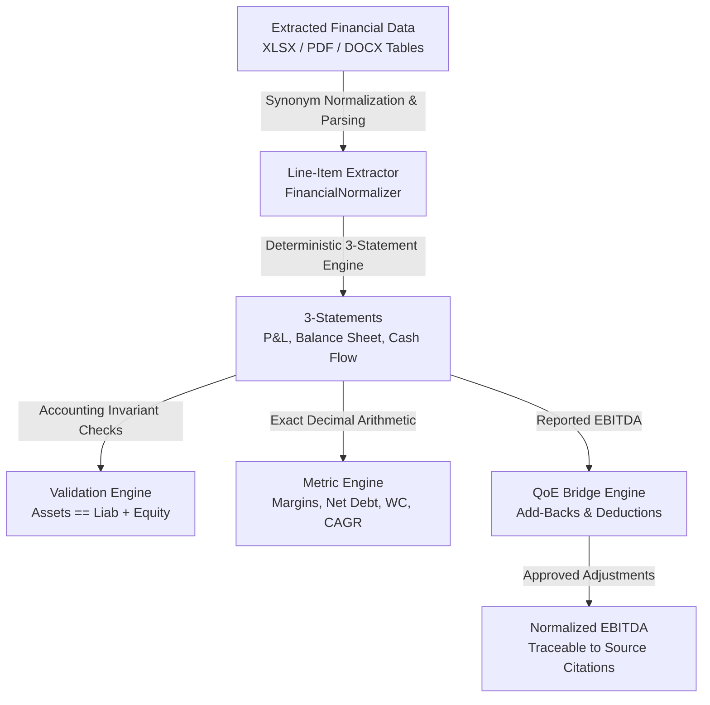

# DealGuard AI — Financial Modeling, Quality of Earnings (QoE) & Metric Engine (Phase 5)

## Overview

Phase 5 delivers the deterministic financial intelligence layer of DealGuard AI. Built on top of the document ingestion and evidence citation infrastructure created in Phase 4, this layer transforms extracted tables into structured 3-statements, derives standardized profitability and leverage metrics using exact `Decimal` arithmetic, computes transparent Quality of Earnings (QoE) EBITDA normalization bridges, and executes automated accounting validation.

---

## 1. Deterministic 3-Statement Modeling

### A. Exact Arithmetic & Missing-Input Invariant
- Calculations use Python `Decimal` (`ROUND_HALF_UP`) to eliminate binary floating-point rounding errors.
- Missing values remain explicitly `None` with missing-input dependency tracking rather than synthetic defaults.

### B. Mathematical Formulations

#### 1. Income Statement
- $\text{Gross Profit} = \text{Revenue} - \text{COGS}$
- $\text{EBIT} = \text{Gross Profit} - \text{OpEx}$
- $\text{EBITDA} = \text{EBIT} + \text{D\&A}$
- $\text{EBT} = \text{EBIT} - \text{Interest Expense}$
- $\text{Net Income} = \text{EBT} - \text{Taxes}$

#### 2. Balance Sheet & Balancing Invariant
- $\text{Total Current Assets} = \text{Cash} + \text{AR} + \text{Inventory} + \text{Other Current Assets}$
- $\text{Total Assets} = \text{Total Current Assets} + \text{PP\&E} + \text{Intangible Assets} + \text{Other Non-Current Assets}$
- $\text{Total Current Liabilities} = \text{AP} + \text{Accrued Liabilities} + \text{Short-Term Debt} + \text{Other Current Liabilities}$
- $\text{Total Liabilities} = \text{Total Current Liabilities} + \text{Long-Term Debt} + \text{Other Non-Current Liabilities}$
- $\text{Total Liabilities \& Equity} = \text{Total Liabilities} + \text{Total Equity}$
- **Balance Equation**: $\text{Total Assets} \equiv \text{Total Liabilities} + \text{Total Equity}$ (Flagged with discrepancy alert if $|\Delta| \ge 0.01$).

#### 3. Cash Flow Statement
- $\text{Cash Flow from Operations (CFO)} = \text{Net Income} + \text{D\&A} - \Delta\text{Working Capital} + \text{Other Operating Non-Cash}$
- $\text{Cash Flow from Investing (CFI)} = -\text{CapEx} - \text{Acquisitions} + \text{Asset Disposals}$
- $\text{Cash Flow from Financing (CFF)} = \Delta\text{Debt Issued/Repaid} + \Delta\text{Equity Issued} - \text{Dividends}$
- $\text{Net Change in Cash} = \text{CFO} + \text{CFI} + \text{CFF}$

---

## 2. Quality of Earnings (QoE) Normalization Bridge

The QoE engine bridges Reported EBITDA to Adjusted / Normalized EBITDA:

$$\text{Adjusted EBITDA} = \text{Reported EBITDA} + \sum \text{Approved Add-Backs} - \sum \text{Approved Deductions}$$

### Supported Adjustment Categories
- `LEGAL_NON_RECURRING`: One-time litigation defense, settlement, or patent dispute costs.
- `ONE_TIME_EXPENSE`: Non-recurring advisory, transaction, or audit preparation fees.
- `RESTRUCTURING`: Severance, facility consolidation, or one-time reorganization costs.
- `OWNER_PERSONAL`: Discretionary founder travel, personal auto, or non-commercial compensation.
- `PRO_FORMA`: Verified annual run-rate vendor synergies or contract price uplifts.
- `ONE_TIME_INCOME`: Gains on asset sales, insurance payouts, or discontinued business lines (treated as deductions).

---

## 3. Financial Ratios & SaaS Metrics

| Metric | Formula | Units |
| :--- | :--- | :--- |
| **Gross Margin** | $(\text{Gross Profit} / \text{Revenue}) \times 100$ | `%` |
| **EBITDA Margin** | $(\text{EBITDA} / \text{Revenue}) \times 100$ | `%` |
| **Net Margin** | $(\text{Net Income} / \text{Revenue}) \times 100$ | `%` |
| **Net Debt** | $\text{Total Debt} - \text{Cash \& Cash Equivalents}$ | `USD` |
| **Net Debt / EBITDA** | $\text{Net Debt} / \text{EBITDA}$ | `x` (Multiple) |
| **Working Capital** | $\text{Total Current Assets} - \text{Total Current Liabilities}$ | `USD` |
| **Working Capital \%** | $(\text{Working Capital} / \text{Revenue}) \times 100$ | `%` |
| **Revenue / EBITDA CAGR** | $[(\text{Ending Value} / \text{Starting Value})^{(1 / n)} - 1] \times 100$ | `%` |
| **Rule of 40** | $\text{YoY Revenue Growth Rate (\%)} + \text{EBITDA Margin (\%)}$ | `Score` |
| **CAC Payback** | $[\text{CAC} / (\text{Annual ARPU} \times \text{Gross Margin})] \times 12$ | `Months` |
| **Net Dollar Retention (NDR)**| $(\text{Cohort Ending ARR} / \text{Cohort Starting ARR}) \times 100$ | `%` |

---

## 4. REST API Reference

All endpoints are mounted under `/api/v1/deals/{deal_id}/financials`:

| Method | Endpoint | RBAC Guard | Description |
| :--- | :--- | :--- | :--- |
| `GET` | `/statements` | `financials:read` | List all 3-statements for deal periods |
| `POST` | `/statements` | `financials:write` | Upsert and automatically derive 3-statement fields |
| `GET` | `/metrics` | `financials:read` | Retrieve time-series ratios, Net Debt, Margins, and SaaS metrics |
| `GET` | `/cagr` | `financials:read` | Multi-year historical revenue and EBITDA CAGR analysis |
| `GET` | `/qoe` | `financials:read` | Fetch Reported EBITDA $\rightarrow$ Adjusted EBITDA normalization bridge |
| `POST` | `/qoe` | `financials:write` | Create QoE add-back or deduction with citation link |
| `PATCH` | `/qoe/{adj_id}` | `financials:write` | Update or approve/reject QoE adjustment |
| `DELETE`| `/qoe/{adj_id}` | `financials:write` | Remove QoE adjustment |
| `GET` | `/validation` | `financials:read` | Run 3-statement balancing & accounting consistency checks |
