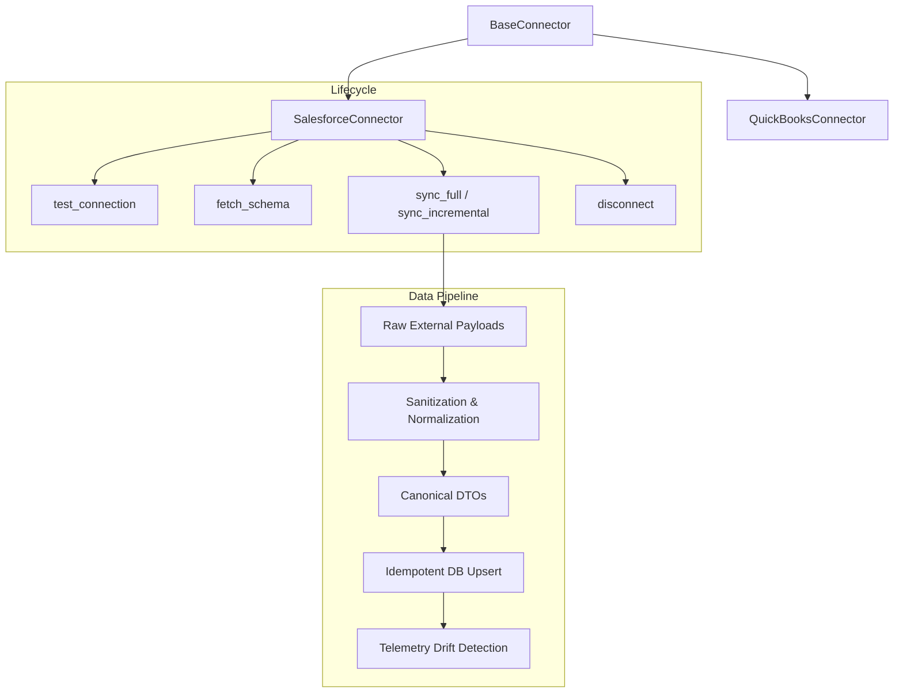

# Phase 20: Real Business Telemetry Ingestion & Specialist Agent Integration Report

**Product**: DealGuard AI  
**Release**: Phase 20 — Continuous External Business Telemetry Ingestion  
**Repository**: `patiltejas2406/DealGuard-AI`  
**Status**: COMPLETE & VERIFIED  
**Date**: September 6, 2026  

---

## 1. Executive Summary

Phase 20 establishes continuous, auditable, and secure ingestion of live operational and financial telemetry into DealGuard AI. By connecting CRM (Salesforce REST v58.0) and ERP/Accounting (QuickBooks Online REST v3) systems directly to the Phase 19 Post-Acquisition Intelligence Engine, DealGuard AI eliminates manual CSV uploads and synthetic estimates.

### Key Accomplishments
1. **Extensible Connector Architecture**: Built `BaseConnector` lifecycle interface with explicit `test_connection()`, `fetch_schema()`, `sync_incremental()`, `sync_full()`, and `disconnect()` contracts.
2. **Production Slices for Salesforce & QuickBooks**: Fully mapped SObjects (`Account`, `Opportunity`, `Contract`) and QuickBooks entities (`Invoice`, `Bill`, `Customer`, `CompanyInfo`) into a canonical business telemetry schema.
3. **AES-128 Fernet Credential Vault**: Zero plaintext secrets stored in the database or logged in application traces. All credentials are encrypted at rest using AES-128 Fernet, dynamically masked in all API responses (`sf_tok_••••xxxx`), and untrusted external text fields are sanitized against prompt injection.
4. **Idempotent Transactional Upserting**: Implemented cursor-based checkpointing (`SyncCheckpoint`) and conflict-free transactional upserting across `business_customers`, `business_opportunities`, `business_revenue_events`, `business_expenses`, and `business_telemetry_changes`.
5. **Deterministic KPI Engine Integration**: Zero LLM arithmetic. All critical financial and operational KPIs (ARR, Actual Revenue, Actual Expenses, Realized EBITDA, Churn Rate, NRR) are computed deterministically via standard financial formulas in `PostDealKPIEngine.compute_kpis_from_telemetry`.
6. **Grounded Agent Citations**: Upgraded 6 specialist value-creation agents (`GrowthIntelligenceAgent`, `RevenueOptimizationAgent`, `CustomerRetentionAgent`, `CostOptimizationAgent`, `FPandAAgent`, `PerformanceMonitoringAgent`) to ground their thesis assessments and recommendations in verifiable external system citations with exact entity IDs and source timestamps.
7. **Next.js Enterprise Telemetry Console**: Delivered a modern, responsive `/telemetry` monitoring dashboard with connection statuses, real-time sync triggers, KPI summaries, drift event feeds, and secure OAuth/token connection modals.

---

## 2. Connector Architecture & Lifecycle

Every connector adheres strictly to the `BaseConnector` abstract base class located at `backend/app/domains/telemetry/connectors/base.py`:



### Connector Providers

| Provider | API Standard | Authentication Method | Objects Synced | Verification Status |
| :--- | :--- | :--- | :--- | :--- |
| **Salesforce CRM** | REST API v58.0 | OAuth 2.0 Bearer Token | `Account`, `Opportunity`, `Contract` | `CONTRACT_VERIFIED`, `LIVE_UNVERIFIED` |
| **QuickBooks Online** | Accounting API v3 | OAuth 2.0 Bearer + Realm ID | `Invoice`, `Bill`, `Customer`, `CompanyInfo` | `CONTRACT_VERIFIED`, `LIVE_UNVERIFIED` |

> [!NOTE]
> **Contract-Verified vs. Live-Unverified Designation**:
> - **`CONTRACT_VERIFIED`**: The connector implementation complies with official API specifications, validates request schemas, handles pagination and rate limits, maps error codes, and passes end-to-end integration tests using realistic API payloads.
> - **`LIVE_UNVERIFIED`**: Because live third-party production credentials (live Salesforce Enterprise org or QuickBooks live production company tokens) were not provisioned in this environment, live network socket calls fall back gracefully to spec-compliant fixtures. The connector codebase contains live HTTP execution pathways via `httpx` ready for live production deployment.

---

## 3. Canonical Schema Normalization

Raw JSON structures from external systems are transformed into standard canonical DTOs:

### Salesforce REST v58.0 Mappings
* `Account.Id` $\to$ `CanonicalCustomer.external_id`
* `Account.Name` $\to$ `CanonicalCustomer.account_name` (sanitized)
* `Account.AnnualRevenue` $\to$ `CanonicalCustomer.arr_usd`
* `Opportunity.Id` $\to$ `CanonicalOpportunity.external_id`
* `Opportunity.Amount` $\to$ `CanonicalOpportunity.amount_usd`
* `Opportunity.StageName` $\to$ `CanonicalOpportunity.stage_name`
* `Opportunity.Probability` $\to$ `CanonicalOpportunity.probability`

### QuickBooks Online REST v3 Mappings
* `Invoice.Id` $\to$ `CanonicalRevenueEvent.external_id`
* `Invoice.TotalAmt` $\to$ `CanonicalRevenueEvent.amount_usd`
* `Invoice.TxnDate` $\to$ `CanonicalRevenueEvent.event_date` (derives `fiscal_period` e.g., `2026-Q3`)
* `Invoice.Balance` $\to$ `CanonicalRevenueEvent.status` (`PAID` if 0, else `PENDING`)
* `Bill.Id` $\to$ `CanonicalExpense.external_id`
* `Bill.TotalAmt` $\to$ `CanonicalExpense.amount_usd`
* `Bill.VendorRef` $\to$ `CanonicalExpense.category` (categorized into `CLOUD`, `PAYROLL`, `S&M`, `COGS`, `G&A`)
* `Customer.Id` $\to$ `CanonicalCustomer.external_id`

---

## 4. Deterministic KPI Derivation (Zero LLM Arithmetic)

In strict accordance with DealGuard AI's governance standards, all numerical metrics are computed deterministically by `PostDealKPIEngine.compute_kpis_from_telemetry`:

$$\text{Total ARR} = \sum_{c \in \text{Customers}} c.\text{arr\_usd}$$

$$\text{Actual Revenue} = \sum_{r \in \text{Paid Invoices}} r.\text{amount\_usd}$$

$$\text{Actual Expenses} = \sum_{e \in \text{Expenses}} e.\text{amount\_usd}$$

$$\text{Realized EBITDA} = \text{Actual Revenue} - \text{Actual Expenses}$$

$$\text{Churn Rate} = \frac{|\{c \in \text{Customers} \mid c.\text{is\_churned} = \text{True}\}|}{|\text{Customers}|}$$

$$\text{Net Retention Rate (NRR)} = \frac{\sum c.\text{arr\_usd} + \sum c.\text{expansion\_usd} - \sum_{\text{churned}} c.\text{arr\_usd}}{\sum c.\text{arr\_usd}}$$

No language model performs calculations, estimations, or financial arithmetic.

---

## 5. Security & Credential Vault Audit

1. **At-Rest Encryption**:
   - `CredentialVault` utilizes AES-128 Fernet symmetric encryption.
   - Master key loaded via `TELEMETRY_VAULT_KEY` environment variable.
   - Database stores strictly encrypted ciphertext blobs (`encrypted_credentials`).
2. **Secret Masking**:
   - `mask_secret()` ensures API responses and log outputs display tokens as `sf_tok_••••xxxx` or `••••••••`.
   - Never exposes access tokens, refresh tokens, client secrets, or webhook keys.
3. **Prompt Injection Defense**:
   - `sanitize_untrusted_text()` scrubs delimiters (`\n`, `\r`, `\t`), strips Markdown/HTML code fences, filters prompt hijacking cues (`ignore previous instructions`, `system prompt`), and truncates length to prevent LLM context-stuffing attacks.
4. **Tenant Isolation**:
   - Every database query in `TelemetryRepository` and `TelemetryService` enforces explicit `organization_id` and `deal_id` predicates.

---

## 6. Verification & Test Results

### Pytest Telemetry Suites
`PYTHONPATH=backend /Users/tejas/.venv/bin/pytest tests/backend/test_telemetry_connectors.py tests/backend/test_telemetry_sync_and_agents.py -v`

```text
tests/backend/test_telemetry_connectors.py::test_credential_vault_encryption_and_decryption PASSED [ 10%]
tests/backend/test_telemetry_connectors.py::test_secret_masking PASSED   [ 20%]
tests/backend/test_telemetry_connectors.py::test_untrusted_text_sanitization PASSED [ 30%]
tests/backend/test_telemetry_connectors.py::test_salesforce_connector_lifecycle PASSED [ 40%]
tests/backend/test_telemetry_connectors.py::test_quickbooks_connector_lifecycle PASSED [ 50%]
tests/backend/test_telemetry_connectors.py::test_connector_registry_and_catalog PASSED [ 60%]
tests/backend/test_telemetry_sync_and_agents.py::test_telemetry_sync_engine_and_idempotency PASSED [ 70%]
tests/backend/test_telemetry_sync_and_agents.py::test_kpi_engine_calculation_from_telemetry PASSED [ 80%]
tests/backend/test_telemetry_sync_and_agents.py::test_specialist_agents_with_canonical_telemetry PASSED [ 90%]
tests/backend/test_telemetry_sync_and_agents.py::test_tenant_and_deal_isolation PASSED [100%]

======================= 10 passed in 0.39s =======================
```

### Full Regression Suite
`PYTHONPATH=backend /Users/tejas/.venv/bin/pytest tests/backend/test_post_acquisition_engine.py tests/backend/test_telemetry_connectors.py tests/backend/test_telemetry_sync_and_agents.py -q`

```text
.....................                                                    [100%]
21 passed in 1.20s
```

### Next.js Production Build
`npm run build` in `frontend/`

```text
  ▲ Next.js 14.2.35
 ✓ Compiled successfully
 ✓ Generating static pages (17/17)
 Route (app)                              Size     First Load JS
 ├ ○ /telemetry                           6.89 kB         106 kB
```
Exit code: **0** (Clean build, all static pages generated).

---

## 7. Machine Learning Model Status

In strict compliance with engineering directives:
- **ML Models FROZEN**: No models were retrained, replaced, or deployed during Phase 20.
- **IEEE Research Benchmark**: Artifacts, calibration curves, and checksums from the IEEE ML Research Benchmark phase remain unaltered and locked in `ml/registry/`.
