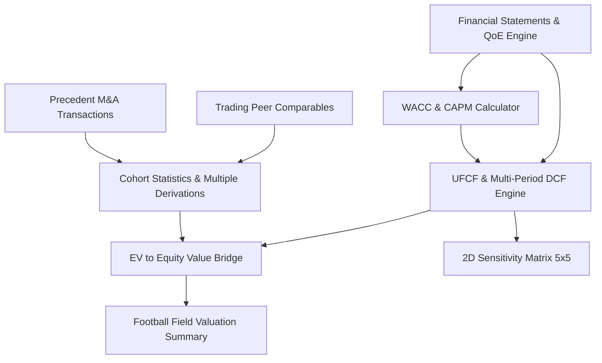

# DealGuard AI — Phase 6: Valuation Intelligence & Deal Valuation Engine

## 1. Overview & Architecture

Phase 6 implements the **Valuation Intelligence & Deal Valuation Engine** for DealGuard AI, transforming structured 3-statement financial intelligence and QoE normalized metrics into defensible, auditable M&A valuation models.

In adherence to DealGuard AI's core non-negotiable principles:
- **No LLM Arithmetic**: All DCF, WACC, UFCF, multiple benchmarking, and sensitivity calculations are deterministic using exact Decimal arithmetic.
- **Traceable Provenance**: Every assumption links to source filings, financial statements, market data, or analyst inputs with citation IDs.
- **Multi-Methodology**: Intrinsic DCF (Perpetuity Growth & Exit Multiple), Trading Peer Comparables (CCA), Precedent Transactions (PTA), and Football Field Valuation Summaries.
- **No Hallucinated Benchmarks**: The platform does not fabricate comparable peers or historical deals.

---

## 2. Valuation Methodologies & Mathematical Formulas

### 2.1 Weighted Average Cost of Capital (WACC) & CAPM
1. **Cost of Equity ($K_e$)**:
   $$K_e = R_f + \beta \times ERP$$
2. **After-Tax Cost of Debt ($K_d$)**:
   $$K_d = \text{Pre-Tax } K_d \times (1 - t)$$
3. **WACC**:
   $$\text{WACC} = \left(\frac{E}{V} \times K_e\right) + \left(\frac{D}{V} \times K_d\right)$$

### 2.2 Unlevered Free Cash Flow (UFCF) & DCF Schedule
1. **UFCF Formula**:
   $$\text{UFCF} = \text{EBIT} \times (1 - t) + \text{D\&A} - \text{CapEx} - \Delta\text{Working Capital}$$
2. **Discount Factor**:
   $$\text{DF}_t = \frac{1}{(1 + \text{WACC})^t}$$
3. **Present Value of Forecast FCFs**:
   $$\text{PV}(\text{Forecast}) = \sum_{t=1}^N \text{UFCF}_t \times \text{DF}_t$$
4. **Terminal Value ($TV$)**:
   - **Perpetuity Growth Method** (Enforces $\text{WACC} > g$):
     $$TV = \frac{\text{UFCF}_N \times (1 + g)}{\text{WACC} - g}$$
   - **Exit Multiple Method**:
     $$TV = \text{EBITDA}_N \times \text{Exit Multiple}$$
5. **Implied Enterprise Value**:
   $$\text{Implied EV} = \text{PV}(\text{Forecast}) + \frac{TV}{(1 + \text{WACC})^N}$$

### 2.3 Enterprise Value to Equity Value Bridge
$$\text{Equity Value} = \text{Enterprise Value} + \text{Cash} - \text{Debt} - \text{Minority Interest} - \text{Preferred Equity} \pm \text{Adjustments}$$

### 2.4 Trading Peers & Precedent Deal Multiples
1. **Multiples**:
   $$\text{EV/Revenue} = \frac{\text{Enterprise Value}}{\text{Revenue}}, \quad \text{EV/EBITDA} = \frac{\text{Enterprise Value}}{\text{EBITDA}}, \quad \text{P/E} = \frac{\text{Equity Value}}{\text{Net Income}}$$
2. **Cohort Aggregations**: Min, 25th Percentile, Median, Mean, 75th Percentile, Max across active `INCLUDED` peers.

---

## 3. Database Schema & Models

Migration `005_valuation_engine_tables.py` adds 5 core relational tables:
1. `valuations`: Primary valuation project record scoped to tenant organization and deal.
2. `valuation_assumptions`: Explicit assumption records with citation provenance and source types.
3. `comparable_companies`: Trading peers with multiples, metrics, and `INCLUDED`/`EXCLUDED` status.
4. `precedent_transactions`: Historical M&A transactions with target, acquirer, deal value, and multiples.
5. `valuation_outputs`: Methodology outputs with low/base/high ranges and JSON calculation details.

---

## 4. REST API Reference

| Method | Endpoint | Description | Permission |
| :--- | :--- | :--- | :--- |
| `GET` | `/api/v1/deals/{deal_id}/valuation` | Get or initialize valuation project | `valuation:read` |
| `PATCH` | `/api/v1/deals/{deal_id}/valuation/{id}` | Update valuation parameters | `valuation:write` |
| `GET` | `/api/v1/deals/{deal_id}/valuation/wacc` | Get WACC analysis | `valuation:read` |
| `POST` | `/api/v1/deals/{deal_id}/valuation/wacc/calculate` | On-demand WACC calculator | `valuation:read` |
| `GET` | `/api/v1/deals/{deal_id}/valuation/assumptions` | List assumptions with provenance | `valuation:read` |
| `POST` | `/api/v1/deals/{deal_id}/valuation/assumptions` | Upsert assumption | `valuation:write` |
| `GET` | `/api/v1/deals/{deal_id}/valuation/dcf` | Get DCF schedule and EV bridge | `valuation:read` |
| `POST` | `/api/v1/deals/{deal_id}/valuation/dcf/calculate` | On-demand DCF calculation | `valuation:read` |
| `GET` | `/api/v1/deals/{deal_id}/valuation/comparables` | Get trading comp analysis & peers | `valuation:read` |
| `POST` | `/api/v1/deals/{deal_id}/valuation/comparables` | Add trading peer company | `valuation:write` |
| `PATCH` | `/api/v1/deals/{deal_id}/valuation/comparables/{id}` | Update peer status / values | `valuation:write` |
| `DELETE` | `/api/v1/deals/{deal_id}/valuation/comparables/{id}` | Delete trading peer | `valuation:write` |
| `GET` | `/api/v1/deals/{deal_id}/valuation/precedents` | Get precedent analysis & deals | `valuation:read` |
| `POST` | `/api/v1/deals/{deal_id}/valuation/precedents` | Add precedent transaction | `valuation:write` |
| `GET` | `/api/v1/deals/{deal_id}/valuation/sensitivity` | 2D Sensitivity heatmap grid | `valuation:read` |
| `GET` | `/api/v1/deals/{deal_id}/valuation/summary` | Football field valuation summary | `valuation:read` |
| `GET` | `/api/v1/deals/{deal_id}/valuation/validation` | Consistency and sanity audit checks | `valuation:read` |

---

## 5. Verification Results

- **Backend Automated Tests**: 74 / 74 tests passing.
- **Frontend Production Build**: 0 errors, Next.js optimized `/valuation` workspace.
- **Real-World Verification**: `verify_phase6.py` verified against CloudDefend Technologies ($60M Rev, $22M EBITDA, 9.34% WACC, 3% g, 10x multiple).
